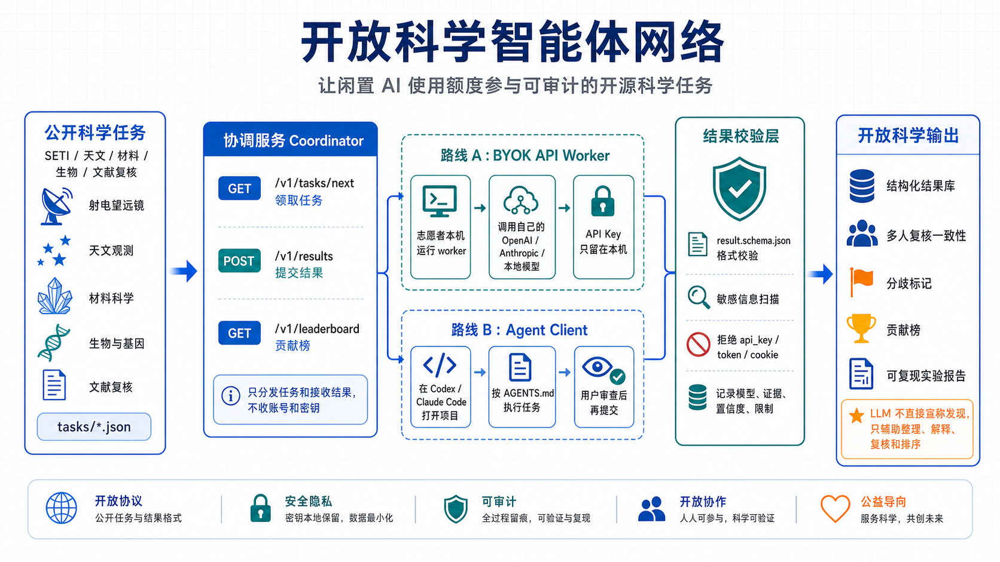

# OpenSETI Agent Network

OpenSETI Agent Network is an open-source volunteer project for auditable SETI
candidate and astronomy data review tasks. It supports two participation modes:

- **BYOK API Worker**: volunteers run a local worker with their own API key.
- **Agent Client**: volunteers open this repository in Codex, Claude Code, or a
  similar local coding agent and complete a task with human review.

The coordinator only distributes public tasks and receives auditable results. It
does not collect user accounts, OAuth tokens, API keys, browser sessions, or
subscription access.

Homepage: <https://openseti.chaochaoweb3.com>



For a Chinese architecture walkthrough, see
[`docs/architecture.zh-CN.md`](docs/architecture.zh-CN.md).

For project direction and maintainer workflow, see [`ROADMAP.md`](ROADMAP.md)
and [`docs/maintainer-operating-loop.md`](docs/maintainer-operating-loop.md).
For release confidence, use [`docs/release-readiness.md`](docs/release-readiness.md).
For new task intake, use [`docs/task-intake-rubric.md`](docs/task-intake-rubric.md).

Project homepage source lives in [`site/`](site/) and can be hosted by GitHub
Pages or any static web server. The architecture can later support other
scientific review tasks, but the public v1 focus is SETI and astronomy.

## What This Is For

The first demo uses public astronomy/SETI-style candidate review. The goal is not
to claim alien discovery. The goal is to make public scientific review work
easier to reproduce:

- summarize candidate signal metadata
- cross-check target context
- classify likely interference or instrument explanations
- produce structured JSON and Markdown evidence
- let multiple volunteers independently review the same task

## Quick Start

```bash
git clone https://github.com/chaochaoweb3/openseti-agent-network.git
cd openseti-agent-network
python3 -m venv .venv
. .venv/bin/activate
pip install -e ".[test]"
pytest
```

Run the coordinator:

```bash
python -m osan.server --host 127.0.0.1 --port 8765
```

Run one dry-run worker task:

```bash
scripts/run-task --task tasks/openseti-demo-001.json --output results/demo-result.json --dry-run
scripts/check-task-intake
scripts/validate-task-manifest
scripts/validate-task tasks/openseti-demo-001.json
scripts/validate-result results/demo-result.json
```

Run the local release smoke path in one command:

```bash
scripts/release-smoke --repeat 3 --task-id openseti-demo-001
```

Submit the result to the local coordinator:

```bash
curl -X POST http://127.0.0.1:8765/v1/results \
  -H 'content-type: application/json' \
  --data-binary @results/demo-result.json
```

View the task catalog, local leaderboard, and one task review summary:

```bash
curl http://127.0.0.1:8765/v1/tasks
curl http://127.0.0.1:8765/v1/leaderboard
curl http://127.0.0.1:8765/v1/tasks/openseti-demo-001/summary
```

Run continuously from the coordinator:

```bash
scripts/run-task \
  --coordinator-url http://127.0.0.1:8765 \
  --submit \
  --repeat 0 \
  --interval 1 \
  --stop-after-seconds 3600 \
  --max-total-cost-usd 0 \
  --dry-run \
  --worker-id local-volunteer
```

Use `--repeat 0` for an infinite loop. Start with `--dry-run` before spending
API budget. For real API providers, set `--max-total-cost-usd` to a real budget
and use a conservative `--interval`.

## BYOK API Worker Mode

Dry-run mode is the default safe demo path and does not use any paid API.

To use an API provider, configure the key only on your own machine:

```bash
export OPENAI_API_KEY="..."
scripts/run-task --task tasks/openseti-demo-001.json \
  --output results/openai-result.json \
  --provider openai \
  --model gpt-4.1-mini
```

The worker reads API keys from local environment variables and never writes them
to result payloads. Result validation rejects common secret fields and token
patterns before submission.

## Agent Client Mode

Open this folder in Codex or Claude Code and ask:

```text
领取一个 OpenSETI 任务并生成结果报告。
```

The agent should follow `AGENTS.md`, inspect `tasks/*.json`, produce a result
matching `schemas/result.schema.json`, run `scripts/validate-result`, and leave
submission under human control.

## Security Boundary

This project intentionally avoids centralized credential pooling.

- Never upload API keys, OAuth tokens, cookies, session IDs, or browser profile
  data.
- Never automate ChatGPT or Claude web subscriptions as a remote proxy.
- Never sell, transfer, or broker another volunteer's account access.
- Keep model credentials local to the volunteer machine or volunteer-owned
  deployment.
- Do not claim discovery of extraterrestrial life from demo outputs. LLMs help
  organize, explain, review, and prioritize evidence; humans make scientific
  judgments.

## Current Status

This repository is a working prototype. It includes:

- a local coordinator API
- a deterministic dry-run worker
- optional OpenAI and Anthropic BYOK provider paths
- a Codex/Claude Code agent workflow
- result schema validation and secret scanning
- task intake validation, scoring, and a public task rubric
- deterministic task manifest checksums for public fixtures
- task catalog and per-task result aggregation endpoints
- a synthetic SETI candidate review demo
- a public TESS-SPOC metadata-only transit review fixture

It does not yet process raw radio telescope data or make autonomous scientific
claims.

## Project Direction

The next milestones are documented in [`ROADMAP.md`](ROADMAP.md). Maintainer
agents should follow the operating loop in
[`docs/maintainer-operating-loop.md`](docs/maintainer-operating-loop.md): refresh
live state, classify work, pick one primary outcome, verify it, and leave a
clear next step. Before public announcements, run the checks in
[`docs/release-readiness.md`](docs/release-readiness.md).

## Acknowledgements

This project was partly inspired by ideas discussed by X user
[`@disksing`](https://x.com/disksing). Mentioning this inspiration does not
imply endorsement, affiliation, or responsibility for this prototype.

## License

Code is licensed under Apache-2.0. Example task/result data is intended for
public scientific reuse under CC0 unless a task declares stricter source terms.
